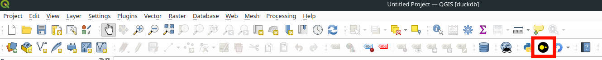
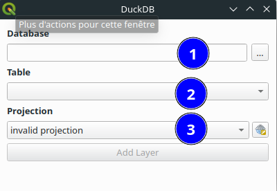

# User documentation

A video demonstration is available [here](https://vimeo.com/885148138?share=copy).

## Use the graphical interface

If the plugin is properly installed, you should see a DuckDB logo in your qgis toolbar.



Clicking on it opens a window. This window will be used to add a layer from a duckdb database



In this window you need to :

- Select a database in the field (1)

Once selected, this will trigger a scan of the tables, and fill in the drop-down menu in field (2).

- Select a table in field (2)

Geographic tables in DuckDB do not support projection systems. You therefore need to tell QGIS what projection the table is in field (3). You can leave this field blank, but in this case your layer will have no CRS and will probably be incorrectly projected in the canvas.

Then click on the add layer button, and your layer will be loaded into the canvas.

You can then do everything you're used to doing in QGIS (query features, open the attribute table, style your layer). On the other hand, you can't edit the table; it's read-only.

## Loading a layer from the command line

You can also use the plugin's command-line data provider.

In the uri you need to provide the same things as in the UI, i.e. the base path, the table name and the EPSG code to define the projection. Here's an example of python code you can use in the qgis python console to do this.

```py
uri = "path=/path/to/my/base/base_test.db table=cities epsg=4326"
layer = QgsVectorLayer(uri, "my_table", "duckdb")
QgsProject.instance().addMapLayer(layer)
```
